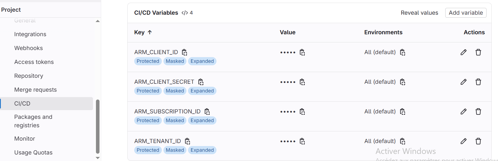

# Déploiement d'une VM Windows avec IIS sur Azure via Terraform & GitLab CI/CD

## Terraform Azure - Structure technique

---

### Modules utilisés

| Module   | Ressources principales                                                                 |
|----------|------------------------------------------------------------------------------------------|
| Network  | VNet, Subnet, Public IP, NIC, NSG, NSG-NIC association                                  |
| Win_VM   | Windows VM, mot de passe aléatoire, **IIS via Custom Script Extension**                 |

---

### Backend

> Utilise un backend Azure pour stocker le fichier terraform.tfstate à distance.

```hcl
terraform {
  backend "azurerm" {
    resource_group_name   = "rg"
    storage_account_name  = "sa_tfstatefile"
    container_name        = "mycontainer"
    key                   = "terraform.tfstate"
  }
}
```
## Root Module

```hcl
# Resource group data source
data "azurerm_resource_group" "rg" {
name = "rg"
}

# Network Module
module "Network" {
  source              = "./modules/Network"
  resource_group_name = data.azurerm_resource_group.rg.name
  location            = data.azurerm_resource_group.rg.location
  prefix              = var.prefix
  ip_allocation       = var.ip_allocation
  sec_rules           = var.sec_rules
}

# Windows Virtual Machine Module
module "Win_VM" {
  source               = "./modules/Win_VM"
  resource_group_name  = data.azurerm_resource_group.rg.name
  location             = data.azurerm_resource_group.rg.location
  admin_username       = var.admin_username
  version              = var.version
  publisher            = var.publisher
  caching              = var.caching
  IIS_publisher        = var.IIS_publisher
  extension_prefix     = var.extension_prefix
  vm_size              = var.vm_size
  vm_prefix            = var.vm_prefix
  storage_account_type = var.storage_account_type
  offer                = var.offer
  sku                  = var.sku
  type                 = var.type
}
```

## Variables - Root module

| **Variable**           | **Type** | **Description**                                                      |
| ---------------------- | -------- | -------------------------------------------------------------------- |
| `prefix`               | string   | Préfixe appliqué à toutes les ressources                             |
| `ip_allocation`        | string   | Méthode d’allocation IP (Dynamic ou Static)                          |
| `sec_rules`            | map      | Map de règles de sécurité pour le NSG                                |
| `admin_username`       | string   | Nom d’utilisateur administrateur de la VM                            |
| `location`             | string   | Région Azure dans laquelle déployer                                  |
| `resource_group_name`  | string   | Nom du groupe de ressources Azure                                    |
| `vm_prefix`            | string   | Préfixe de nom de la machine virtuelle                               |
| `extension_prefix`     | string   | Préfixe pour l’extension d’installation d’IIS                        |
| `vm_size`              | string   | Taille (SKU) de la VM                                                |
| `caching`              | string   | Mode de caching pour le disque OS                                    |
| `storage_account_type` | string   | Type de stockage (Standard\_LRS, Premium\_LRS, etc.)                 |
| `publisher`            | string   | Publisher de l’image VM (ex : MicrosoftWindowsServer)                |
| `offer`                | string   | Famille d’OS (ex : WindowsServer)                                    |
| `sku`                  | string   | SKU spécifique (ex : 2019-Datacenter)                                |
| `version`              | string   | Version de l’image (ex : latest)                                     |
| `IIS_publisher`        | string   | Publisher de l’extension d’installation IIS (ex : Microsoft.Compute) |
| `type`                 | string   | Type de l’extension (ex : CustomScriptExtension)                     |

## Authentification Azure (Service Principal)
> Terraform s'authentifie à Azure via un Service Principal, configuré dans les variables d’environnement GitLab CI.
> Le Service Principal a été généré manuellement Azure CLI avec les droits suffisants sur le Resource Group cible.
   
    az ad sp create-for-rbac --role="Contributor" --scopes="/subscriptions/xxxx/resourceGroups/rg"

Ces variables sont définies dans Settings > CI/CD > Variables du projet GitLab.
Voici une capture d'écran montrant la configuration :




## CI/CD - GitLab (.gitlab-ci.yml)
```yaml
workflow:
    rules:
      -  if: $CI_COMMIT_BRANCH == "main" && $CI_COMMIT_TITLE =~ /gitlab$/
         when: always
      -  if: $CI_PIPELINE_SOURCE != "push" &&  $CI_PROJECT_VISIBILITY != "public"  
         when: never  

stages:
       - Validation
       - Previsualization
       - Application
       
default:
    image: 
        name: hashicorp/terraform:latest
        entrypoint:
           - /usr/bin/env
           - "PATH=/usr/local/sbin:/usr/local/bin:/usr/sbin:/usr/bin:/sbin:/bin"
    
    before_script:
        - cd terraform_azure
        - terraform init 
    cache:
       key: terraform-cache
       paths:
       - terraform_azure/.terraform/

terraform_validate:
    stage: Validation
    script:
        - terraform validate    

terraform_plan:
    stage: Previsualization
    environment: 
        name: "Production"
    script:
        - terraform plan -out=myplan
        - pwd
        - ls -la 
    artifacts:
        name: "$CI_ENVIRONMENT_NAME-plan"
        paths: 
        - terraform_azure/myplan    

terraform_apply:
    stage: Application
    script:
        - terraform apply --auto-approve myplan
    rules:
      - if : $CI_COMMIT_BRANCH == $CI_DEFAULT_BRANCH
        when: manual  
```

## Conclusion

Ce projet permet de déployer automatiquement une infrastructure Azure complète avec réseau sécurisé et VM Windows configurée avec IIS. Le pipeline GitLab CI/CD assure un déploiement fiable et structuré.

## Auteur

CHATTI ISSAM — [Linkedin](https://www.linkedin.com/in/issam-chatti-172838123) | [Github](https://github.com/ISSA-AZTF)